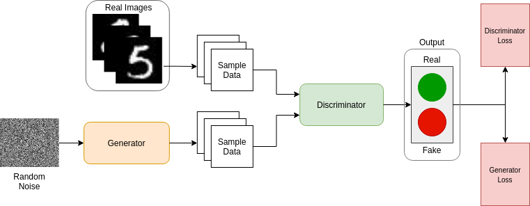
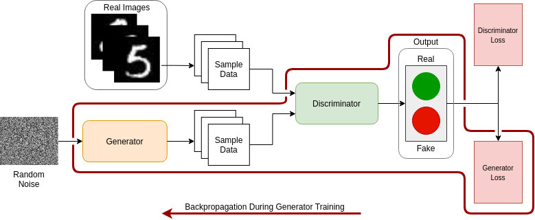
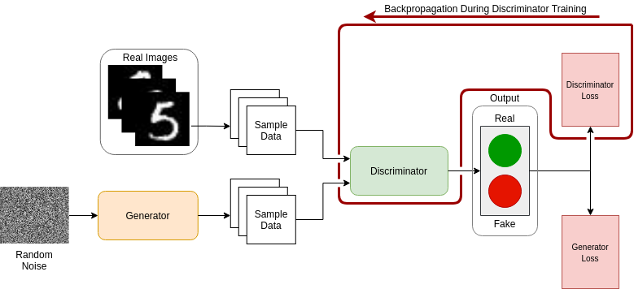

# Understanding the world of Generative Adversarial Networks (Part 1)

Generative Adversarial Networks (GANs) belong to the family of generative models (see [OpenAI][1]). 
Making use of Deep Learning (DL) techniques, we can train GANs to generate many types of new data, such as images, texts, and also tabular data.
In recent years, GANs have gained much popularity in the field of DL. And all of this started after the famous paper by [Goodfellow et al][2].

So, in this post, we will get to know about GANs and how it can be useful when working on Machine Learning.

## What Will You Learn in This Post?

1. Introduction to GANs.
2. The Generator.
3. The Discriminator.
4. Applications of GANs

## 1. Introduction

*Fig. 1: The architecture of a GAN.*

## 2. The Generator

*Fig. 2: Generator Training.*

## 3. The Discriminator

*Fig. 3: Discriminator Training.*

## 4. Applications

Nowadays there are lots of applications for GANs. Bellow we are going to explore some of them.

* Data Augmentation
* Face Anonymization 

## Conclusion

## References
[1]: https://openai.com/blog/generative-models/
[2]: https://arxiv.org/pdf/1406.2661.pdf
[3]: https://arxiv.org/pdf/1909.04538.pdf
