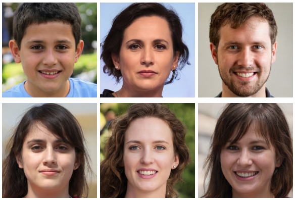
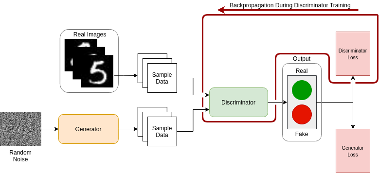
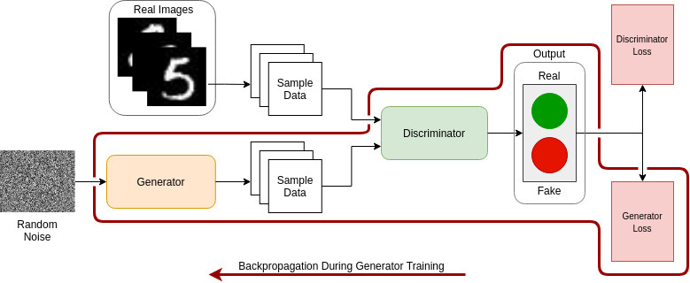
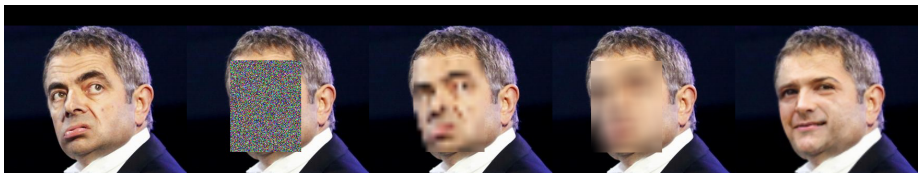
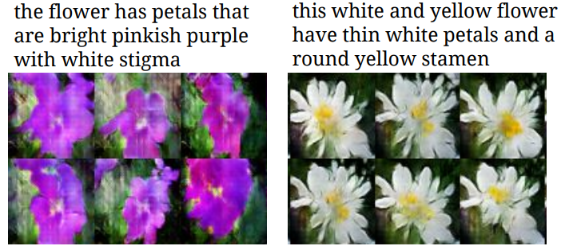
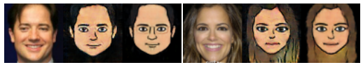

# Understanding the World of Generative Adversarial Networks - Part 1

Generative Adversarial Networks (GANs) were introduced by [Goodfellow et al][2] in 2014. They belong to the family of generative models (see [OpenAI][1]). Making use of Deep Learning (DL) techniques, we can train GANs to generate many types of new data, such as images, texts, and also tabular data.

In recent years, GANs have gained much popularity in the field of DL. So, in this post, we will get to know about this model and how It can be useful.

## What Will You Learn in This Post?

1. Introduction to GANs
2. How It Works
3. The Learning Process
4. Applications of GANs

## 1. Introduction

The basic idea of GANs is that they are used to generate images that never existed before. So, they can learn about the context of the dataset we have (such as text, music, objects, animals and so forth) and create new versions of those data that never existed. Under the hood, they are an unsupervised learning technique. This is because, while training a GAN, we do not provide any label or target to the model.

Probably, the most popular use of GANs are that realistic examples of fake people images (which do not look fake at all) as you can see in Fig. 1.

*Fig. 1: Fake people images generated by GANs. Font: [https://thispersondoesnotexist.com/][4].*

## 2. How It Works

The general architecture of a GAN is represented by the following image.

*Fig. 2: The architecture of a GAN. Font: The author.*

And as we can see, a GAN has two components: the **generator** and the **discriminator**. Both components are Neural Networks that compete with each other. In other words, the Generator tries to fool the Discriminator with fake images.

While training a GAN, the **Generator** tries to generate new fake data from a given noisy sample space. 
And after each iteration, It will learn to create images as much realistic as possible (regarding our dataset).
At the same time, the **Discriminator** tries to distinguish the real data from the generated fake data (created by the generator). 
While training the discriminator, we have to feed It with both real and generated data. 

After a certain number of training epochs, eventually the the discriminator won’t be able to tell whether the data is real or fake. 
When this time comes, we can stop the training and use the generator to create new data for our need.

Now we are going through the training process of both components.   

## 3. The Learning Process

As we saw before, the learning process is a minimax game between two networks, a generator, which generates synthetic data given a random noise vector, and a discriminator, which discriminates between real data and the generator’s synthetic data.

### Training the Discriminator

We can say that the discriminator is a binary classifier that classifies whether a sample is positive or negative.
So, the output of it is a probability of a given sample being real (with label 1) or fake (generated by the generator, with label 0).

To train the discriminator, we go through a few steps:

1. Feed the discriminator with real data;
2. Compute loss from the discriminator classification;
3. Feed the discriminator with fake data;
4. Compute loss from the discriminator classification;
5. Sum the two computed losses;
6. In the final step, the weights of the discriminator network get updated through the backpropagation process.

This process is represented in Fig. 3.

*Fig. 3: Training the discriminator in a GAN. Font: The author.*

<!-- After pass the real data through the discriminator, we get the probability of this data being real (label 1) or fake (label 0). If the discriminator misclassifies the data (either when it classifies the real data as fake or when it classifies the fake data as real), then it will generate a higher loss value. --> 

<!-- This process is repeated for the fake data as well to obtain the loss using the fake data. -->

<!-- After computing both losses, they are summed. Then, the backpropagation algorithm goes into action to update the weights of the discriminator.
 -->

### Training the Generator

The generator's job is to generate fake images from a given random noise. Epoch after epoch, it tries to produce more realistic data.
These fake images are used as inputs of the discriminator and they act as the negative samples for the discriminator training process.
So, for training the generator we have to go through the following steps:

1. Create the random noise;
2. Use this noise as input of the generator to get fake data;
3. Use the generated fake data as input of the discriminator;
4. Compute the loss from the discriminator classification;
5. The loss from the discriminator is used to penalize the generator for producing bad data instances;
6. Finally, we have the loss from the generator outputs. It will be used to penalize the generator itself if it's not fooling the discriminator.

This process is represented in Fig. 4.

*Fig. 4: Training the generator in a GAN. Font: The author.*

<!-- After we get the generator loss, the backpropagation happens through both discriminator and generator. --> 

<!-- This process need to happen because we have to check with the discriminator how close the generator is to create realistic fake data. So, we are not going to update the weights of the discriminator. We just use this feedback together with the loss of the generator itself to update the weights of the generator.

Therefore, repeating this process for several epochs, eventually the generator will fool the discriminator. -->

We repeat this process for several epochs, then eventually the generator will fool the discriminator as we expected.

## 4. Applications

Nowadays there are lots of applications for GANs. Most of them are related to the Image Processing area.

Bellow we are going to explore some of them.

### Data Augmentation

One of the most currently use of GANs is for data augmentation.

Let's pick a scenario where we have a Machine Learning (ML) algorithm performing badly, and it's happening because it was trained with a poor dataset with almost no variability. It is in here that GANs can be used for. 

Whenever we have a poor dataset, we can generate more data from It using GANs. 
Then, we probably would have a ML model with better performance 

It is well known that GANs are a very interesting and cool way to generate synthetic data. If you became curious about it, you can check this [paper][5] out.

### Face Anonymization 

The core idea of face anonymization is to remove all privacy-sensitive information and also generate a new, realistic face for data visual integrity.
Research in this area are becoming very popular because applying this technique, companies can use any data for their needs without consent.
Fig. 4 shows a result of using a GAN to remove sensitive information of an image.

*Fig. 4: Face Anonymization using GAN. Font: [Hakon Hukkelas et al][6] paper.*

You can read more about it in this [paper][6], which the authors proposed a GAN, called DeepPrivacy, that automatically anonymize faces in images while retaining the original data distribution.

### Text to Image

Text to Image is another cool application that GANs are used.
Here we can generate images from a given sentence. An example is shown in Fig. 5.

*Fig. 5: Results of using GAN to generate images from sentences. Font: [Scott Reed et al][7] paper.*

This task is very challenging because it demands a enormous amount of data and computational resources as well.
You can see some results in this [paper][7] by Scott Reed et al.

### Photo to Avatar

There are a bunch of mobile apps and sites that are performing this task nowadays.
Most of them probably use a GAN as part of its backend.
This is very useful when we don't want to use our own photos as profile pictures of sites we have accounts.
You can see an example of it in Fig 6. But you can also check this [paper][8] out if you want to see more results.

*Fig. 6: Results of using GAN to generate avatars from images. Font: [Lior Wolf et al][8] paper.*

## Conclusion

In this post we could understand what are Generative Adversarial Networks and how they work.
Also, we could see some very nice applications we can use this model (maybe we're already using without knowing). 

In the next part of this series we will take a deeper look at these models.
We are also going to build, train and use our model in the Pytorch framework. 
And, to do this, we are going to work with the [MNIST][9] dataset.

[1]: https://openai.com/blog/generative-models/
[2]: https://arxiv.org/pdf/1406.2661.pdf
[3]: https://arxiv.org/pdf/1909.04538.pdf
[4]: https://thispersondoesnotexist.com/
[5]: https://arxiv.org/pdf/1904.09135.pdf
[6]: https://arxiv.org/pdf/1909.04538.pdf
[7]: http://proceedings.mlr.press/v48/reed16.pdf
[8]: https://research.fb.com/wp-content/uploads/2017/08/unsupervised-creation-parameterized.pdf
[9]: http://yann.lecun.com/exdb/mnist/