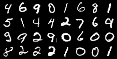
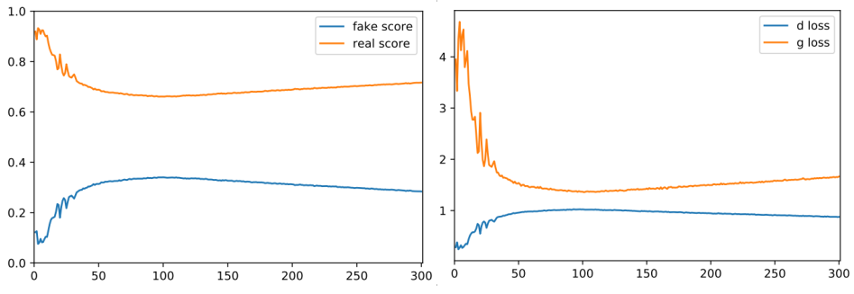
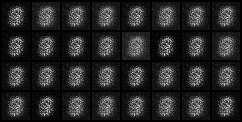
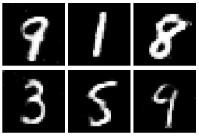

# Understanding the World of Generative Adversarial Networks - Part 2

In the first part of this series we understand how GANs works and what they are used for.

We already know that generative models consists of two neural networks (the Discriminator and the Generator).
So, in this article we will learn how to train and evaluate a GAN to generate handwritten digits.

We will be using Pytorch as the framework and the full code is available in [this GitHub repository](https://github.com/dsjardim/pytorch_gan).


## Loading the Data

When we are talking about training these models, if our dataset doesn't have a considerable number of training samples, it's very hard to achieve good results for any metric. So, in order to train our model, we are going to use the [MNIST Handwritten Digits][1] dataset, which has 60.000 training samples of handwritten digits. And each image have its resolution defined as 28 x 28 (width, height). 

Lets take a look in some of these training images.




Pytorch provides an easy way to download the training samples using a few lines of code.
But before downloading the data, we have to define some transformations we need to apply on our data before feeding it into the training pipeline. We do this using the ```torchvision.transforms```. It basically transform each image to tensor format and normalize it.

```python
transform = transforms.Compose([transforms.ToTensor(),
                                transforms.Normalize(mean=(0.5),
                                                     std=(0.5))])
```

Now, with the following code snippet, we download the data, apply the transformations in it and load it to DataLoader, which split the data into batches and provides iterators over the dataset.

```python
mnist = torchvision.datasets.MNIST(root='PATH_TO_STORE_TRAINSET',
                                   train=True,
                                   transform=transform,
                                   download=True)

train_loader = torch.utils.data.DataLoader(dataset=mnist,
                                           batch_size=batch_size, 
                                           shuffle=True)
```


## Building the Model

Both discriminator and generator are Multilayer Perceptrons (MLPs) with two hidden layers.

In Pytorch, the ```torch.nn``` module allow us to build both neural networks very easelly.
Also, the ```nn.Sequential``` wraps the layers in the network.

Lets look at the following code snippet, which builds the Discriminator of our GAN.

```python
D = nn.Sequential(
    nn.Linear(784, 256),
    nn.LeakyReLU(0.2),
    nn.Linear(256, 256),
    nn.LeakyReLU(0.2),
    nn.Linear(256, 1),
    nn.Sigmoid())
```

As you can see, there are three **Linear** layers with **leaky ReLU** activation function. 
The first two are called **hidden layers** and the last one is our **output layer**.
Also, the output layer is followed by a ```Sigmoid``` function because we want to calculate the probability of an image being real or fake.

Probably, you must be wondering why do we have 784 units in the first layer. Good! 
It is because we flatten out each image before sending it inside the neural network. (28 x 28 = 784)

The generator have the same architecture. But different parameters for each layer. 

Lets take a look at the code used to build it.

```python
G = nn.Sequential(
    nn.Linear(64, 256),
    nn.ReLU(),
    nn.Linear(256, 256),
    nn.ReLU(),
    nn.Linear(256, 784),
    nn.Tanh())
```

You can see that the parameters appear to be almost reversed compared to the discriminator.

It make sense, because here we are not classifying a given image, we are trying to create a new one.
So, in the first layer, we receive a random noise vector as input. 
And the following layers try to fit this input to generate a image that look like our training data. 


## Training Time

Here is where the "magic" happens.

As we discussed on the [previous post](https://github.com/dsjardim/pytorch_gan/blob/master/posts/BlogPost1.md) of this series, training a GAN consists of training the generator and the discriminator.

Before going through the training loop, we have to define the optimizer and the loss function for each neural network. 
In this example, we will use the ```Adam``` as optimizer and for the loss function, we will use the ```BCELoss``` because we are working on a binary problem. 
You can check the full code and execute it yourself in this [notebook](https://github.com/dsjardim/pytorch_gan/blob/master/notebooks/DCGAN_train.ipynb).

With that been said, we can start the training.
So, for each epoch of our training loop, we iterate over the entire data using the  ```train_loader``` variable we created at the beginning of this article.
As the ```train_loader``` return our data in form of batches, the first thing to do is to create our labels for training both discriminator and generator.
These labels consists of two tensors, one for the real samples and another for the fake ones. You can see in the following code snippet how we create them.

```python
images = images.view(batch_size, -1).to(device)
real_labels = torch.ones(batch_size, 1).to(device) ## 1 for real samples
fake_labels = torch.zeros(batch_size, 1).to(device) ## 0 for fake samples
```

The next step is to feed the discriminator with some real images. So, the output of it will be a probability of each image being real or fake.
To measure how the discriminator is predicting these images, we call the loss function with two parameters: the output of the discriminator and the real label we just created. Then, we will know the error rate of the discriminator when handling real images.


```python
outputs = D(images)
d_loss_real = criterion(outputs, real_labels)
real_score = outputs
```

Now, we have to feed the discriminator with some fake images.

To do that, we create a random noise and pass it to the generator. The output of it should be something like the real images.
Having done that, we feed the discriminator with these fake images and we go through the same process as before. 
But now, we will have the error rate of the discriminator for the prediction of fake images.

Finally, we sum those two error rates to obtain the real loss of the discriminator. Therefore, this loss will be used to backpropagate the error and update the weights of the discriminator.

```python
z = torch.randn(batch_size, latent_size).to(device)
fake_images = G(z)

outputs = D(fake_images)
d_loss_fake = criterion(outputs, fake_labels)
fake_score = outputs

d_loss = d_loss_real + d_loss_fake
```

The next and final step is the process of teaching the generator to create fake images that look like the real ones.

To do that, we create a random noise and pass it to the generator. And it will generate the fake images.

Then, we feed the discriminator with these fake images and we will obtain the probability of each image being real or fake.
We call the loss function and use these probabilities as one of the parameters. The second parameter will be the real labels. Why? (you should be asking).
We do that because we want to know how far the generator is to fool the discriminator. 
And we use this error rate to backpropagate on the generator and update its weights.  

```python
z = torch.randn(batch_size, latent_size).to(device)
fake_images = G(z)
outputs = D(fake_images)

g_loss = criterion(outputs, real_labels)
```

At the beginning of the training process, these fake images will look like noise. But after a while, the generator will learn to create very good looking fake images. And we will see some examples on the next part of this post.


## Evaluation and Conclusions

We trained our GAN through 300 epochs and after that we evaluate our model.

During training, we stored information about the Loss for both discriminator and generator. Also, we got information about the Accuracy of the discriminator for classifying images as real or fake.

Lets take a look at this data in form of graphs.



First, analyzing the accuracy of the discriminator. It starts classifying real images with high accuracy, but after a while, it starts to make mistakes more often, which is expected. At the same time, for fake images classification, the discriminator start the training with high accuracy as well (close to 0 because it's a fake image) and after a while, it starts to make mistakes because the generator are creating images very close to the training images. 

Now, lets talk about the loss of both discriminator and generator.
We can see that the loss of the generator decreases and the loss of the discriminator increases.
This is what we want! Because it indicates that our generator learned to create images that reproduce the training data. And this is why the discriminator starts to make mistakes. It no longer knows whether a given image is real or fake.

The following GIF present the learning process of the generator.



For an evaluation, we test our GAN in order to generate some handwritten digits. And the result are the following



As you can see, there is no difference between these generated images from those from the MNIST dataset we saw in the beginning of this article.

Therefore, it proves that we can use GANs to augment our dataset. Here we have worked with a dataset of images, but we can train and use this models for any kind of dataset. The only constraint is that the dataset have to be a large number of training samples. 


[1]: http://yann.lecun.com/exdb/mnist/
